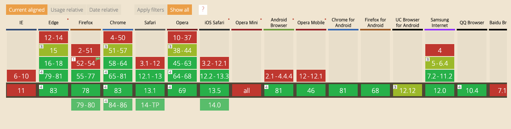
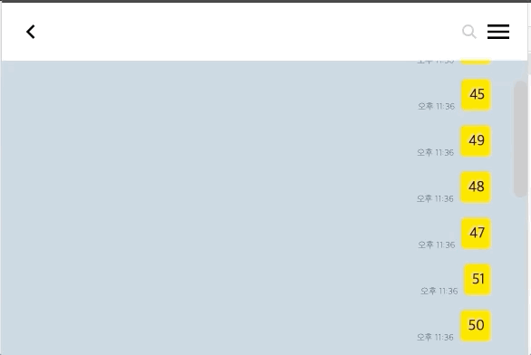

# 무한 스크롤

무한 스크롤 은 다양한 웹사이트, 어플리케이션에서 볼 수 있다. 일반적으로 보여주고 싶은 데이터가 많은 경우 이를 한번에 모두 렌더링 하는 것은 비효율적이다. 왜냐하면 사용자가 그 많은 데이터를 모두 볼 확률도 낮고 사용자는 그 많은 데이터를 다운받는 네트워크 리소스 낭비가 발생하면서 동기에 초기 로딩 속도가 느려지기 때문이다. 만약 우리 사이트를 방문하는 사용자들이 배터리도 빨리 닳고 데이터 소모량도 늘어나는걸 발견한다면 다시 방문하지 않을 가능성이 높아 질 수도 있겠다.

데이터가 많다 -> 나눠서 보여주자 -> 페이지네이션 or 무한 스크롤 등으로 생각을 옮겨 볼 수 있는데 페이지네이션과 무한스크롤은 데이터를 제공해주는 성격이 조금 다른 것 같다. 페이지네이션 같은 경우 여러데이터를 페이지로 쪼개서 나누는데 첫번째 의미가 있고 두번째 의미는 사용자에게 데이터의 위치를 특정할 수 있도록 도와주는 것이다. 그래서 1페이지에 3번째글, 3페이지에 9번째 글 처럼 위치를 기억해서 다시 해당 게시물에 접근 할 수 있다.

반면에 무한 스크롤은 위치를 특정할 수 없지만 한 페이지 내에서 많은 데이터를 렌더링 할 수 있다. 그래서 좀 더 나은 UX 를 보여줄 수 있다.

인스타그램이나 페이스북 같은 경우가 그런한데 방금 전에 봤었던 데이터를 다시 보고 싶을 때 페이지를 아무리 내려도 찾을 수 없는 경우가 발생할 수도 있다. 기업들은 여기에 무슨 인공지능을 이용해서 개인화 된 추천 시스템을 도입하고 사용자가 좋아할 만한 데이터를 마구잡이로 끼워 넣어주는 것 같다.

일단 카키오톡에서는 그냥 채팅데이터가 너무 많으면 한번에 다 렌더링 할 수 없기 때문에 이를 나눠서 보여주기 위해서 무한 스크롤을 사용하기로 했다. 대부분의 채팅 어플리케이션을 다 이런방식일 거다.

알아본 결과 무한 스크롤을 `scroll` 이벤트, `intersection observer API` 두가지 방식으로 구현 가능하다. 

###  `scroll` 이벤트 

```javascript
window.addEventListener('scroll', () => {
  const y = window.scrollY
  const clientHeight = document.element.clientHeight
  const scrollHeight = document.element.scrollHeight

  if(y + clientHeight > scrollHeight) {
    // 데이터 더 불러오기
  }
})
```
위에 코드처럼 `scroll` 이벤트의 리스너에서 현재 스크롤위치를 파악해서 만약 전체 스크롤 길이보다 길게 내려 갔다면 데이터를 요청하면 된다. 


스크롤 포지션은 여러가지 요소가 있는데 위에 그림을 보면 대충 알 수 있다.

구현하기는 매우 간단하지만 조금더 만져줘야할 부분이 있다. `scroll` 이벤트는 매우 빈번하게 일어나기 때문에 그때마다 저 콜백함수가 동작한다면 웹 어플리케이션 성능에 안좋을 영향을 끼친다. 왜냐하면 `scroll` 을 하면서 현재 위치를 알아내기 위해 `clientHeight` 같은 계산된 프로퍼티 값을 요구하는데 이는 브라우저의 `reflow` 를 유발하기 때문이다. - [reflow 유발하는 것들](https://gist.github.com/paulirish/5d52fb081b3570c81e3a)

- Throttle : 마지막 함수가 호출된 후 일정 시간이 지나기 전에 다시 호출되지 않도록 하는 것
- Debounce : 연이어 호출되는 함수들 중 마지막 함수(또는 제일 처음)만 호출하도록 하는 것

그래서 `throttle` 이나 `debounce` 를 걸어서 모든 요청을 걸지 않고 성능을 높여주는 등의 추가작업을 해줘야 한다.

# Intersection Observer

Intersection Observer API는 타겟 요소와 상위 요소 또는 최상위 document 의 viewport 사이의 intersection 내의 변화를 비동기적으로 관찰하는 방법입니다. - [MDN](https://developer.mozilla.org/ko/docs/Web/API/Intersection_Observer_API)

사실 이 말을 아직도 이해하지 못하겠다. 어쨋든 element 가 화면에 보이면 그걸 알아챌 수 있도록 해준다는 거고 여러가지 용도로 사용될 수 있다. 카키오톡에서는 2번의 이유로 사용한다.

1. 페이지가 스크롤 되는 도중에 발생하는 이미지나 다른 컨텐츠의 지연 로딩.
2. ***스크롤 시에, 더 많은 컨텐츠가 로드 및 렌더링되어 사용자가 페이지를 이동하지 않아도 되게 하는 infinite-scroll 을 구현.***
3. 광고 수익을 계산하기 위한 용도로 광고의 가시성 보고.
4. 사용자에게 결과가 표시되는 여부에 따라 작업이나 애니메이션을 수행할 지 여부를 결정.

`Intersection Observer` 같은 경우 `scroll` 이벤트보다 약간 제약사항이 있는게 모든 브라우저에서 지원하지 않는다. 왠만한 브라우저는 다 지원되지만 `IE` 를 꼭 지원해야하는 상황이라면 그것도 그것대로 귀찮겠다.


일단 비동기적으로 동작하기 때문에 메인스레드를 사용하지 않고 그만큼 성능상의 이점을 얻을 수 있다. `scroll` 이벤트로 구현할 때 처럼 `throttle` 이나 `debounce` 처리를 해줄 필요가 없다.


# 구현
```typescript
/* eslint-disable @typescript-eslint/no-explicit-any */
import {
  DependencyList, useCallback, useEffect, useRef,
} from 'react'

interface UseIntersectionObserver {
  (cb: (entry: IntersectionObserverEntry) => void,
  options: IntersectionObserverInit,
  deps: DependencyList): (node: any) => void
}

const useIntersectionObserver: UseIntersectionObserver = (cb, options, deps) => {
  const intersectionObserver = useRef<IntersectionObserver | null>(null)

  return useCallback((node) => {
    if (intersectionObserver.current) {
      intersectionObserver.current.disconnect()
    }

    intersectionObserver.current = new IntersectionObserver(([entry]) => {
      cb(entry)
    }, options)

    if (node) intersectionObserver.current.observe(node)
  }, deps)
}

export default useIntersectionObserver
```
일단 이렇게 생긴 custom hook 을 만들어 놓는다. 여기서 해주는 일은 특정 영역에 붙일 수 있는 함수를 생성해주는것. 이 함수는 `(node) => void` 형태인데 이런 형태의 함수는 `jsx` 에서 `ref` 속성에 넣어줄 수 있다. 그러면 해당 `element` 가 `viewport` 와 교차되면 함수가 실행되는 형태다.

지금 카키오톡 채팅방에서는 방 컴포넌트 안에 채팅을 보여주는 컴포넌트가 있고 거기서도 컴포넌트가 또 쪼개진다. 한번에 몰아쓰면 구현이 쉬워지겠지만 관리하기가 너무 더러워지기 때문에 적절히 쪼개다 보니 `forward ref` 를 이용해서 `useIntersectionObserver hook` 을 통해 생성한 함수를 전달해서 `ref` 속성에 넣어주게 되었다.

```typescript
// firstChat 는 첫번째 채팅을 의미함
// 최상단 chat 컴포넌트에 붙여준다.
const firstChat = useIntersectionObserver(
  (entry: IntersectionObserverEntry) => {
    if (entry.time < 5000) return
    if (!entry.isIntersecting) {
      return
    }
    dispatch(loadMoreRequest(roomUuid))
  },
  { root: root.current },
  [roomUuid]
)
...

chats.map((chat, idx) => (
  <div key={chat.uuid} ref={idx === chats.length - 1 ? lastTop : null}>
    <ChatBox
      chat={chat}
      isMine={userUuid === chat.metaInfo.sender.uuid}
      // 최상단 채팅이면서 첫번째 채팅이 아닌경우 (첫번쨰 채팅이면 더 요청할 게 없으므로)
      ref={idx === chats.length - 1 && chat.uuid !== firstChat.uuid ? first : null}
    />
  </div>
))
```

# demo




# Reference
- [what forces layout / reflow](https://gist.github.com/paulirish/5d52fb081b3570c81e3a)
- [MDN - Intersection Observer](https://developer.mozilla.org/ko/docs/Web/API/Intersection_Observer_API)
- [zerocho 블로그](https://www.zerocho.com/category/JavaScript/post/5aa23cd4e70ee8001bc60b9a)
- [velog@yejinh](https://velog.io/@yejinh/Intersection-Observer%EB%A1%9C-%EB%AC%B4%ED%95%9C-%EC%8A%A4%ED%81%AC%EB%A1%A4-%EA%B5%AC%ED%98%84%ED%95%98%EA%B8%B0)
- [web club - throttle, debounce](https://webclub.tistory.com/607)
- [react offcial - forward ref](https://ko.reactjs.org/docs/forwarding-refs.html)