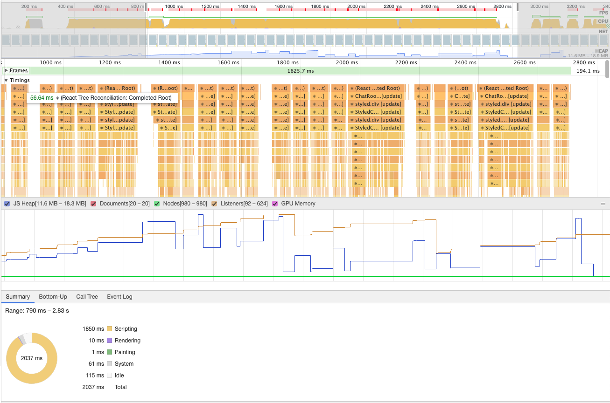
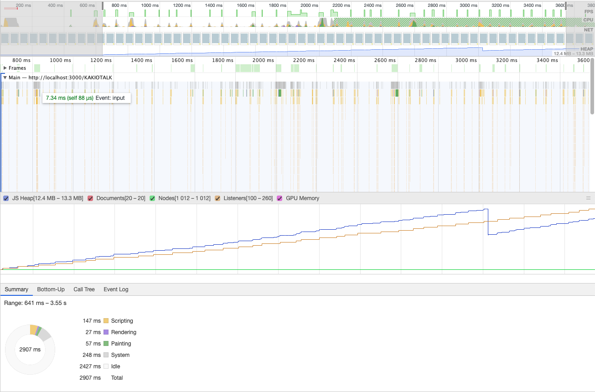

# Input Handler 처리

가끔 handler 처리시간이 길게 소요되면 개발자 도구 콘솔에 다음과같은 에러메시지를 발견할 수 있다.

`[Violation] 'input' handler took 205ms`

Violation 이라하니 뭔가 고쳐야 할 것 같은 느낌이 들었고 input handler 가 어떻게 생겼는지 궁금해졌다.

## Input With State

채팅방 컴포넌트는 대충 이렇게 생겼는데 거의 뭐 채팅입력을 위한 컴포넌트나 마찬가지다. 일단 input element 는 ref, value, onChange, onKeypress 4가지 값에 의존적이다. 그 중 handler 는 onChange, onKeypress 두개다.

하나하나 살펴보면 일단 messageRef 는 별로 하는 일이 없다. 채팅을 전송할 때 포커싱 해주는 정도.

handleEnterPress 는 input 에서 enter 키가 입력되었을 경우 handleSubmit 을 실행시켜준다.

handleMessageChange 은 input 에 값이 변경될 떄마다 value 값인 messagee 를 갱신해준다. 그러면 연쇄적으로 message 에 대한 dependency 를 갖고 있는 useEffect 가 실행된다. 여기서는 메시지가 있는 경우 전송 버튼을 활성화 시켜준다.

코드는 지저분하지만 하는일을 복잡하지 않다. 이런 상황에서 아까같은 violation 메시지를 만났으니 성능을 측정해보자.

```typescript
const messageRef = useRef<HTMLInputElement>(null);
const [message, setMessage] = useState<string>("");
const [hasContent, setHasContent] = useState<boolean>(false);

useEffect(() => {
  if (message) {
    setHasContent(true);
  } else {
    setHasContent(false);
  }
}, [message]);
const handleSubmit = () => {
  if (!messageRef || !messageRef.current) {
    return;
  }
  if (!message) {
    return;
  }

  chatFromClient({
    content: message,
    roomUuid,
    createdAt: getCurTimeDBFormat(),
    userUuid: uuid,
  });

  if (messageRef.current) {
    messageRef.current.focus();
  }
  setMessage("");
};
const handleEnterPress = (e: KeyboardEvent<HTMLInputElement>) => {
  if (e.key === "Enter") {
    if (e.target && e.currentTarget.value.trim().length > 0) {
      handleSubmit();
    }
  }
};

const handleMessageChange = (e: ChangeEvent<HTMLInputElement>) => {
  setMessage(e.target.value);
};

return (
  <S.InputArea
    ref={messageRef}
    value={message}
    onChange={handleMessageChange}
    onKeyPress={handleEnterPress}
  />
);
```

나는 사실 성능측정하는법을 모른다. 그냥 profiler 돌려서 나온 사진을 보면 뭔가 굉장히 많은 일이 벌어졌고 통계가 나왔다. 각 항목에 마우스를 올려보면 react tree reconcillation 이라고 하는데 [reconcillation는](https://ko.reactjs.org/docs/reconciliation.html) 리액트에서 UI 를 다시 그리는 작업이라고 한다. 키보드로 입력을 할때마다 reconcillation 이 일어났고 페이지가 다시그려졌기 때문에 나는 내가 입력한 키가 input element 에 들어가 있는것을 알 수 있다.

- scripting - 1850ms
- rendering - 10ms
- painting - 1ms
- system - 61ms
- idle - 115ms
- total - 2037ms



여기서 성능을 조금이라도 올리려면 어떻게 해야할까? 일단 필요없는 부분을 찾아보자. 사실은 message 라는 state 를 유지하는 것은 여기서는 큰 의미가 없다. message 라는 state 를 사용할 때는 메시지를 서버로 전송할 때와 input element 에 키보드 입력을 했을때 전송버튼을 노란색으로 바꿀때이다. 그러면 message 라는 state 를 뺴고도 지금이랑 동일하게 동작하도록 바꿔본다.

## Input Without State

이제는 message 라는 state 가 사라졌고 input 은 ref, onChange, onKeyPress 3개 attribute 에 의존적으로 동작한다. message state 가 없어진 만큼 messageRef 를 이용해서 역할을 대체시켜줘야한다. 그래서 message state 를 참조하던곳은 messageRef.current.value 로 바꿔주었고 message 에 dependency 가 걸려있던 useEffect 는 지운다음 handleMessageChange 에서 그 역할을 대신해주었다.

```typescript
const messageRef = useRef<HTMLInputElement>(null);
const [hasContent, setHasContent] = useState<boolean>(false);

const handleSubmit = () => {
  if (!messageRef || !messageRef.current) {
    return;
  }

  const msg = messageRef.current.value;
  chatFromClient({
    content: msg,
    roomUuid,
    createdAt: getCurTimeDBFormat(),
    userUuid: uuid,
  });

  if (messageRef.current) {
    messageRef.current.focus();
    messageRef.current.value = "";
  }
};
const handleEnterPress = (e: KeyboardEvent<HTMLInputElement>) => {
  if (e.key === "Enter") {
    if (e.target && e.currentTarget.value.trim().length > 0) {
      handleSubmit();
    }
  }
};

const handleMessageChange = (e: ChangeEvent<HTMLInputElement>) => {
  if (messageRef.current) {
    if (messageRef.current.value) {
      setHasContent(true);
    } else {
      setHasContent(false);
    }
  }
};

return (
  <S.InputArea
    ref={messageRef}
    onChange={handleMessageChange}
    onKeyPress={handleEnterPress}
  />
);
```

결과를 보자. 일단 뭔가가 눈에 띄게 줄어들었다. message state 가 사라지니 state 변경에 따른 react tree reconcillation 이 일어나지 않는다.



각 항목에 마우스를 올려보면 단순히 Input 이벤트를 처리하는 것 같다.

- scripting - 147ms
- rendering - 27ms
- painting - 57ms
- system - 248ms
- idle - 2427ms
- total - 2907ms

message state 가 있었을떄와 비교하면

- scripting - 1850ms -> 147ms
- rendering - 10ms -> 27ms
- painting - 1ms -> 57ms
- system - 61ms -> 248ms
- idle - 115ms -> 2427ms
- total - 2037ms -> 2907 ms

많이 줄었다. idle 시간이 늘어나긴 했지만 실제 js 실행시간이 줄었고 rerendering, painting 시간이 늘었지만 js 시간이 줄은거에 비하면 신경쓸 정도는 아닌것 같다.

## react-hook-form

비슷한 느낌으로다가 form 태그를 성능좋게 사용할 수 있도록 도와주는 라이브러리가 있다. Uncontrolled Component 로 동작하지만 다양한 기능을 수행할 수 있는 것 같다. 현재 내 상황에서는 굳이 form 태그로 바꿀 이유는 없는것 같아 적용은 하지 않았다.

## Reference

- [react-hook-form](https://react-hook-form.com/kr/)
- [Uncontroller Component](https://blog.sonim1.com/184)
- [Uncontrolled Component (리액트 공식문서)](https://ko.reactjs.org/docs/uncontrolled-components.html)
