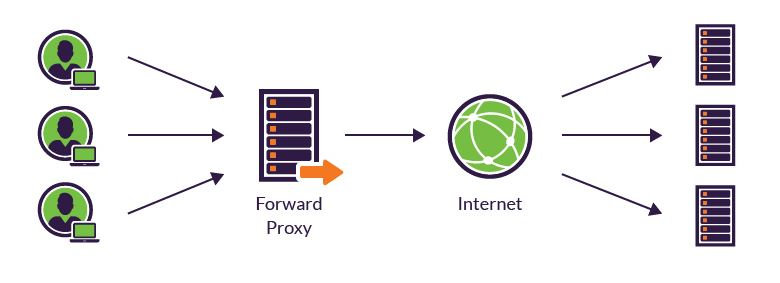

# Nginx 

## Nginx 는 뭔가요

- 아파치와 더불어 가장 많이 쓰이는 웹 서버 이다.
- 아파치와 다르게 요청에 응답할 때 Event Driven 방식으로 동작하기 때문에 적은 수의 스레드로도 효율적인 처리가 가능하다고 한다.
- 스레드를 많이 사용하지 않기 때문에 context switching 비용이 적고 CPU 소모적이지 않다.
- 주로 정적 파일을 서비스하는데 쓰이고 리버스 프록시로써의 역할도 수행할 수 있다.

## Reverse Proxy

- `forward proxy` 는 `client` 를 `server` 로 부터 숨겨주는 역할을 한다. 숨겨주는게 본연의 역할은 아닌것 같지만.. client 를 한데 모아서 요청을 처리해주는 느낌이다.
- `reverse proxy` 는 다른 서버의 정보를 프록시를 통해 받아오는 부류의 프록시를 말하며, `Client` 가 요청하는 `End point` 는 실제 서버 주소가 아닌 `reverse proxy` 의 주소를 가리키게 된고 서버의 문지기 같은 느낌으로 존재한다.
- 이를 통해 load balancing 이나 캐싱, 보안상의 이유로 (서버 노출 하지 않음) 사용될 수 있다.
- 밑의 그림을 보면 인터넷에 앞에 있냐 뒤에 있냐에 따라 쉽게 구분할 수 있다.



## KakioTalk 에 Reverse Proxy 의 역할?

KakioTalk 은 원래 Client 는 `github pages` 로 , 서버는 `google cloud build` 로 자동배포가 나가고 있었다. 하지만 기술적인 여러 문제로.. `google cloud build` 는 덜어내고 수동배포로 가기로 결정.

그래서 `pm2` 로 서버에서 띄워봤더니 [`Mixed Content`](https://developers.google.com/web/fundamentals/security/prevent-mixed-content/what-is-mixed-content?hl=ko) 에러가 뜨면서 서버로 부터 데이터를 받아올 수 없었다. 보안상의 이유로 `https` 에서 `http` 의 요청을 금지하고 있어서 서버도 `https` 통신을 만들어 줘야했다.

일단 `domain` 이 필요, 가비아에서 1500 원 짜리 `kakio.site` 구매 후 server ip 연결.

`https` 를 위해서는 일단 인증서가 필요한데 돈이 없으니 일단 무료 서비스인 [`lets encrypt`](https://www.google.com/search?q=lets+encrypt&oq=lets+encrypt&aqs=chrome.0.69i59l3j35i39j0j69i60l3.15162j1j7&sourceid=chrome&ie=UTF-8) 를 이용한다. 

복잡해 보이지만 이미 `certbot` 이라는 라이브러리를 다 만들어 놔서 실행만 해주면 된다. - [참조](https://velog.io/@pinot/Ubuntu-18.04%EC%97%90%EC%84%9C-Lets-Encrypt%EB%A5%BC-%EC%82%AC%EC%9A%A9%ED%95%98%EC%97%AC-Nginx%EC%97%90-SSL%EC%9D%84-%EC%A0%81%EC%9A%A9%ED%95%98%EB%8A%94-%EB%B0%A9%EB%B2%95)

1년 마다 자동으로 갱신까지 해준다고 한다.

`KakioTalk` 은 기본적으로 하나의 서버만 구동한다. 하지만 역할을 보면 두개로 나눌 수 있는데 `api server` 와 `socket server` 이다. 매우 바쁜 서비스의 경우는 각각 분리하는 것 같은데 우리서비스는 사실 이용자가 없다고 봐도 무방하기 때문에 하나의 node 서버만 사용하도록 했다.

개인 PC 에서 작업할 때는 localhost 로 요청을 보내면 알아서 받아주지만 서버로 배포를 했을 떄는 `Nginx` 를 타고 들어가기 때문에 `Nginx` 가 `Reverse Proxy` 의 역할을 수행해서 `socket` 요청인 것과 아닌것 (api 요청) 을 분리해준다. 사실 이런것도 `reverse proxy` 라고 부르는지는 모르겠다. 어쨌든 `connection` 을 분리해주니까 `reverse proxy` 라고 생각하기로 했다.

## Nginx

보통 domain 별로 설정파일을 `/sites-available` 에 하나씩 만들어서 관리한다고 한다.

밑에 각 설정들을 주저리 주저리 써놨지만 잘 모른다. 내가 생각하기에 중요한 부분은 밑에 있는게 다임. 부끄럽지만 뭐가 어떤 의미인지 잘모름.. 검색해도 잘 안나오지만 일단 동작한다. 나중에 알아보고 주석 해놔야지

```nginx
# /sites-avaliable/kakio.site
server{
  server_name kakio.site www.kakio.site;

  # @#$@#4.io 아닌 모든 요청은 여기서 처리
  location / {
    proxy_set_header X-Forwarded-For $proxy_add_x_forwarded_for;
    proxy_set_header Host $host;

    proxy_pass http://localhost:3050/; // api server 주소
  }
  
  # !@#.io 로 끝나는 요청을 여기서 처리
  location ~* \.io {
          proxy_set_header X-Real-IP $remote_addr;
          proxy_set_header X-Forwarded-For $proxy_add_x_forwarded_for;
          proxy_set_header Host $http_host;
          proxy_set_header X-NginX-Proxy false;

          proxy_pass http://localhost:3050; // socket server 주소 
          proxy_redirect off;

          proxy_http_version 1.1;
          proxy_set_header Upgrade $http_upgrade;
          proxy_set_header Connection "upgrade";
  }
}

```
----
## 설정파일 설명
- 기본 설정파일 경로는 `/etc/nginx/nginx/conf` 에 위치하고 전역 설정파일이라고 생각하면 된다.

```nginx
# 이 설정은 worker process가 root권한으로 실행되게 한다. 파일 시스템의 모든 권한을 얻게되므로 보안상 위험하다.
user root;
# 워커 프로세스는 CPU core 수에 따라 설정해야한다. nginx는 그 이상의 이득을 주지는 않는다.
# 기본값은 1이지만 CPU가 2개이상의 코어를 갖는다면 이 값을 증가시키도록 권장한다.
# auto - 자동적으로 계산한다.
worker_processes auto; 
pid /run/nginx.pid;


# 연결 처리에 영향을주는 지시문이 지정되는 구성 파일 컨텍스트를 제공한다.
events {
  # 워커 하나가 몇명의 유저가 서비스를 할지 결정한다.
  # max clients = worker_connections * worker_processes
  # max clients 는 시스템에서 연결가능한 소켓 개수에 따라 제한한다. (~64k)
 	worker_connections 1024;
	# multi_accept on;
  
  # 테스팅 환경을 위해 각 스레드마다 많은 클라이언트를 서비스하도록 최적화한다.
  # use epoll;
  
}

http {

	##
	# Basic Settings
	##

	sendfile on;
	tcp_nopush on;
	tcp_nodelay on;
	keepalive_timeout 65;
	types_hash_max_size 2048;
	# Nginx의 버전을 숨길것인가에 대한 옵션이다. 보안상 주석을 제거하여 설정하는 것이 좋다.
	# server_tokens off;

	# server_names_hash_bucket_size 64;
	# server_name_in_redirect off;

  # include 는 이름 그대로 특정 파일을 포함시키는 역할을 한다.
  # include 지시어가 있는 위치에 해당 파일의 내용을 삽입한다.
	include /etc/nginx/mime.types;
	default_type application/octet-stream;

	##
	# SSL Settings
	##

	ssl_protocols TLSv1 TLSv1.1 TLSv1.2; # Dropping SSLv3, ref: POODLE
	ssl_prefer_server_ciphers on;

	##
	# Logging Settings
	##

  # 참조 1에 따르면 HDD에 대한 I/O 성능을 높이기 위해 off 할 수도 있다.
  # ex) off;
  access_log /var/log/nginx/access.log;
  
  # 에러 로그 파일을 저장할 위치
  # 참조 1에 따르면 끝에 crit 옵션을 주어서 성능을 높일 수 있다고 한다.
  # ex) error_log /var/log/nginx/error.log crit;
	error_log /var/log/nginx/error.log;

	##
	# Gzip Settings
	##

	gzip on;
	gzip_disable "msie6";

	# gzip_vary on;
	# gzip_proxied any;
	# gzip_comp_level 6;
	# gzip_buffers 16 8k;
	# gzip_http_version 1.1;
	# gzip_types text/plain text/css application/json application/javascript text/xml application/xml application/xml+rss text/javascript;

  # 응답이 없는 client와의 연결을 끊는 것을 허용함으로써 이를통해 메모리를 비울 수 있다.
  reset_timedout_connection on;
  
  # request timed out -- default 60
  # 참조 1에 의하면 10
  client_body_timeout 60;
  
  
  # 서버는 이 시간후에 커넥션을 종료함 -- 기본값 75
  keepalive_timeout 30;
  
	##
	# Virtual Host Configs
	##

	include /etc/nginx/conf.d/*.conf;
	include /etc/nginx/sites-enabled/*;
}
```

### Nginx 의 설정파일은 크게 4가지 지시어블록을 가지고 있다.

#### http 블록
http 블록은 이후에 소개할 server, location의 루트 블록이라고 할 수 있고, 여기서 설정된 값을 하위 블록들은 상속한다. http 블록은 여러개를 사용할 수 있지만 관리상의 이슈로 한번만 사용하는 것을 권장한다.

http, server, location 블록은 계층구조를 가지고 있다. 많은 지시어가 각각의 블록에서 동시에 사용할 수 있는데, http의 내용은 server의 기본값이 되고, server의 지시어는 location의 기본값이 된다. 그리고 하위의 블록에서 선언된 지시어는 상위의 선언을 무시하고 적용된다.

#### server 블록
server 블록은 하나의 웹사이트를 선언하는데 사용된다. 가상 호스팅(Virtual Host)의 개념이다. 예를들어 하나의 서버로 http://opentutorials.org 과 http://egoing.net 을 동시에 운영하고 싶은 경우 사용할 수 있는 방법이다. 가상 호스팅에 대한 자세한 내용은 가상 호스팅 수업을 참고하자.

#### location 블록
location 블록은 server 블록 안에 등장하면서 특정 URL을 처리하는 방법을 정의한다. 이를테면 http://opentutorials.org/course/1 과 http://opentutorials.org/module/1 로 접근하는 요청을 다르게 처리하고 싶을 때 사용한다.

#### events 블록
이벤트 블록은 주로 네트워크의 동작방법과 관련된 설정값을 가진다. 이벤트 블록의 지시어들은 이벤트 블록에서만 사용할 수 있고, http, server, location와는 상속관계를 갖지 않는다. 이벤트 모듈 지시어에 대한 설명은 이벤트 모듈 지시어 사전을 참고한다.


# 명령어
ubuntu 18.04.4 LTS 기준이다.
- 재시작

```shell
systemctl restart nginx
```

- config 테스트
제대로 설정되었는지 확인해 볼 수 있다. (문법 검사)
```shell
nginx -t
/etc/init.d/nginx configtest
```

- symbolic link 생성
  
왜그런진 모르겠지만 `sites-available` 에서 작성하고 symbolic link 를 `sites-enabled` 폴더에 생성해서 설정을 연결한다.
```shell
ln -s /etc/nginx/sites-available/kakio.site /etc/nginx/sites-enabled
```

- 로그

```shell
# Nginx의 오류 로그 실시간 확인
tail -f /var/log/nginx/error.log
# Nginx의 서버 접근 기록 실시간 모니터링
tail -f  /var/log/nginx/access.log
```


# 지시어

### 문자열

- 지시어 값으로 사용되는 문자열은 세가지 형태로 나타나는데, 우선 따옴표를 사용하지 않고 문자열을 나타낼 수 있다.

```nginx
root    /home/example.com/www;
```

- 하지만, 공백 문자(""), 세미콜론(;), 중괄호({}) 같은 특수 문자를 사용하려면 작은 따옴표나 큰따옴표 안에 지시어 값을 넣어야 한다.

```nginx
root    '/home/example.com/my web pages';
```


### 에러로그

가장 상세한 로그 레벨부터 차례로 debug, info, notice, warn, error, crit가 됩니다. 애플리케이션, HTTP 서버, 가상 호스트, 가상 호스트 디렉토리 각각에 대해 다른 레벨로 에러 로그를 설정할 수 있다.

로그 출력 방향을 /dev/null로 전환하면 에러 로그를 해제하는 것과 같은 효과를 얻을 수 있습니다. 환경 설정 파일의 루트 부분에 다음의 지시어를 사용한다.

```nginx
error_log {file_path} {level}
# ex) error_log /var/log/nginx/access.log;
# ex) error_log /var/log/nginx/access.log crit;
# ex) error_log /dev/null crit; # 에러 로그 해제
```


## References
1. [NGINX Tuning For Best Performance](https://gist.github.com/denji/8359866)
2. [Nginx 기본 환경 설정](https://12bme.tistory.com/366)
3. [가상 호스트](https://www.joinc.co.kr/w/man/12/Nginx/virtualhost)
4. [symbolic link](https://qjadud22.tistory.com/22)
5. [오픈 튜토리얼스](https://opentutorials.org/module/384/3462) 
6. [Naver D2](https://d2.naver.com/helloworld/1336)
7. [Google Web - Mixed content](https://developers.google.com/web/fundamentals/security/prevent-mixed-content/what-is-mixed-content?hl=ko)
8. [lets encrypt](https://www.google.com/search?q=lets+encrypt&oq=lets+encrypt&aqs=chrome.0.69i59l3j35i39j0j69i60l3.15162j1j7&sourceid=chrome&ie=UTF-8)
9. https://velog.io/@pinot/Ubuntu-18.04%EC%97%90%EC%84%9C-Lets-Encrypt%EB%A5%BC-%EC%82%AC%EC%9A%A9%ED%95%98%EC%97%AC-Nginx%EC%97%90-SSL%EC%9D%84-%EC%A0%81%EC%9A%A9%ED%95%98%EB%8A%94-%EB%B0%A9%EB%B2%95
10. https://victorydntmd.tistory.com/231